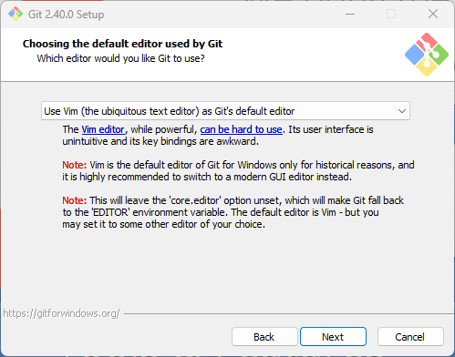
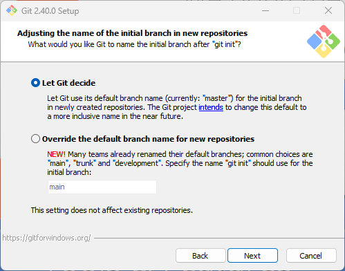
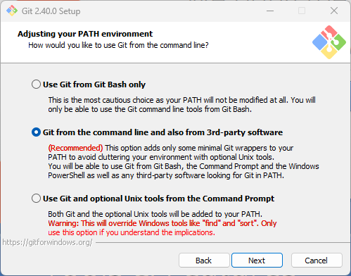
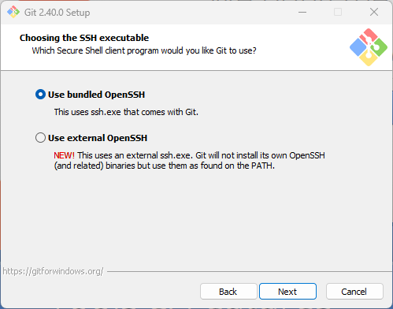
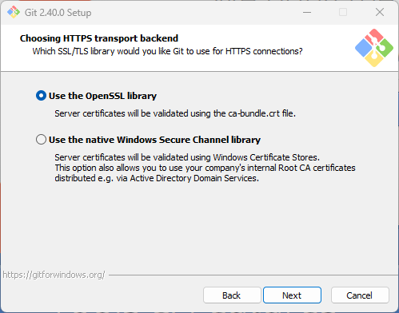
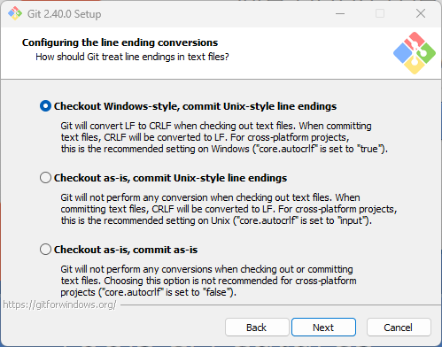
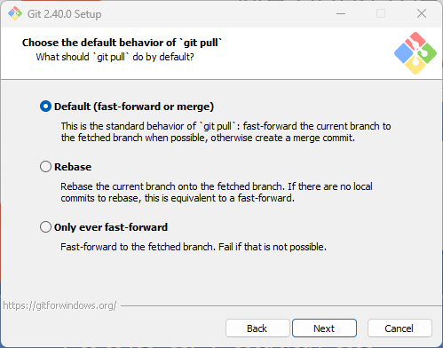

{}

# Premiers pas
Installation, configuration et concepts de base

---

## Installation de Git

### Linux

- Git est généralement installé directement dans la plupart des distributions Linux.
- Sinon, il est installable dans un terminal au travers du gestionnaire de paquets de la distribution :
    - Debian : `sudo apt install git-all`
    - Fedora : `sudo dnf install git-all`

---

### macOS

- Sur macOS Mavericks (10.9) ou ultérieur, Git est fourni au travers des Xcode Command Line Tools.
- Il suffit d'essayer de lancer Git dans un terminal via une commande comme `git --version` pour que macOS propose de l'installer avec d'autres outils de développement.
- Sinon, il est possible d'utiliser [Homebrew](https://brew.sh/) via `brew install git` ou de [télécharger l'installateur](https://git-scm.com/download/mac).

---

### Windows

- Sur Windows, l'installation de Git est possible grâce au projet [Git for Windows](https://gitforwindows.org/) qui fournit Git avec un émulateur de ligne de commande Bash.
- Une façon simple de l'installer de manière automatisée est d'utiliser [Scoop](https://scoop.sh/) pour installer Git avec la commande `scoop install git`.
- Sinon, il est possible de [télécharger l'installateur via le site officiel](https://git-scm.com/download/win) ou avec WinGet.

---

#### Choix de l'éditeur de texte par défaut

- Vim est un bon choix pour des utilisateurs habitués à utiliser des programmes en ligne de commande.
- Sinon, il vaut mieux utiliser un éditeur avec une interface graphique comme Notepad++ ou VS Code.

---

#### Nom de la branche initiale dans les nouveaux dépôts

- Il est désormais recommandé pour travailler avec des outils tiers de sélectionner l'option *Override the default branch name for new repositories* et de choisir `main` comme nom par défaut.

---

#### Inscription de Git dans les variables d'environnement

- *Git from the command line and also from 3rd-party software* permet d'utiliser Git avec d'autres logiciels installés sur l'ordinateur, notamment des IDE.
- *Use Git and optional Unix tools from the Command Prompt* donne accès à des commandes Unix dans la ligne de commande Windows.

---

#### Choix de l'éxécutable SSH

- Depuis Windows 10, un client SSH est directement intégré à Windows. Il est donc possible de l'utiliser en choisissant *Use external OpenSSH* pour mutualiser les configurations.

---

#### Choix du magasin de certificats HTTPS

- L'option *Use the native Windows Secure Channel library* permet de bénéficier des certificats de sécurité déployés dans un cadre professionnel via un domaine Active Directory. 

---

#### Conversion des fins de ligne

- À configurer en fonction des habitudes de l'équipe :
  - *Checkout Windows-style, commit Unix-style line endings* est recommandé sous Windows pour un projet multi-plateformes.
  - *Checkout as-is, commit Unix-style line endings* peut s'utiliser si toute l'équipe travaille avec des logiciels adaptés au monde Unix.

---

#### Comportement par défaut du pull

- À configurer en fonction des habitudes de l'équipe.
  - En l'absence de préférence, l'option *Default (fast-forward or merge)* est plus simple à appréhender dans un premier temps. 

{}