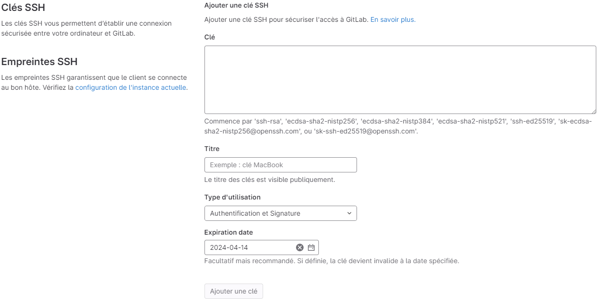
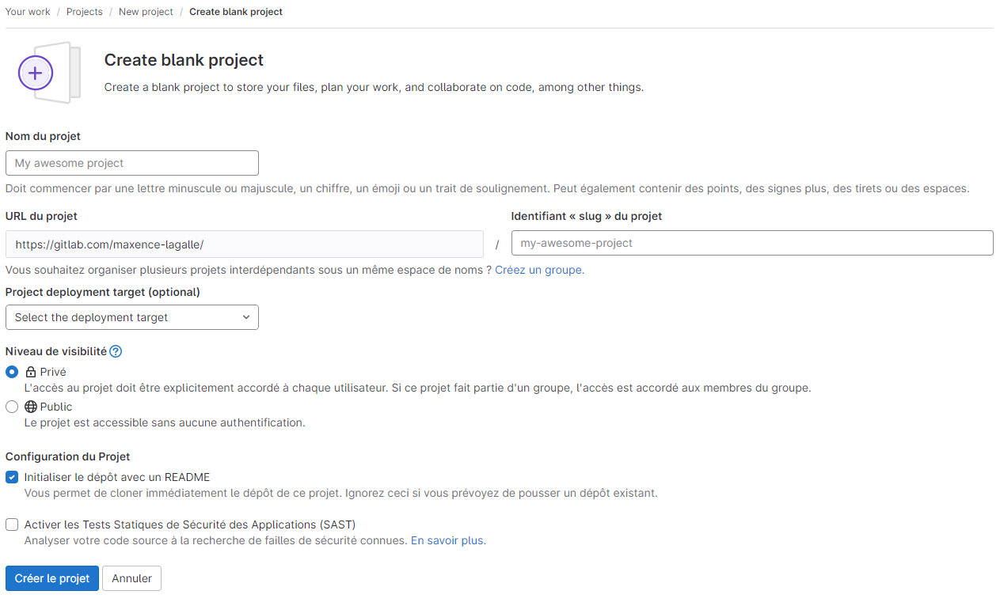
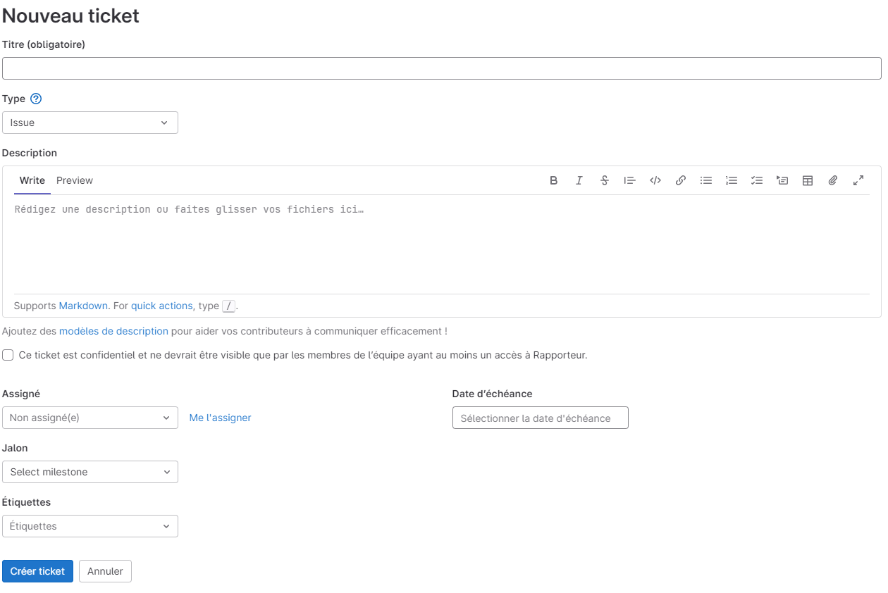
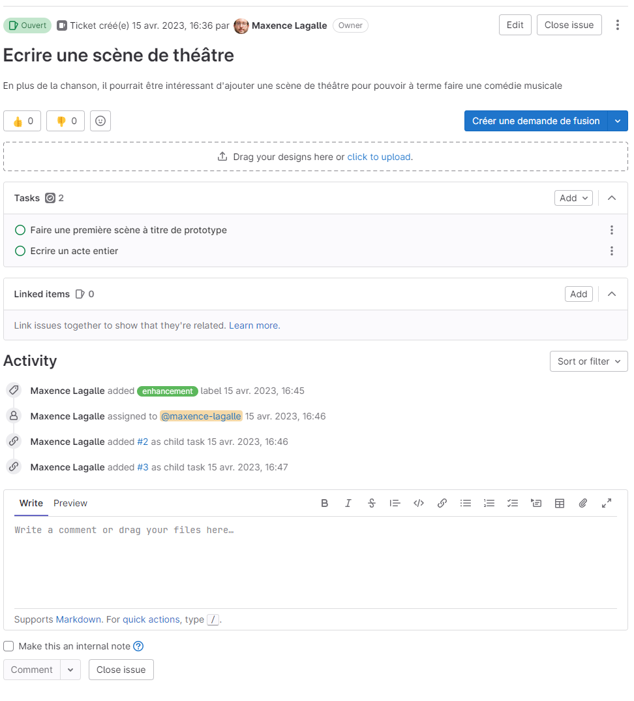
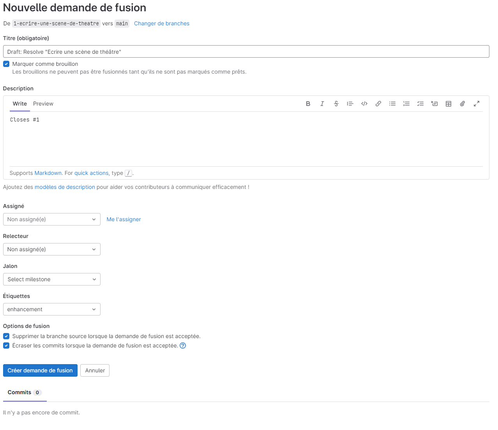
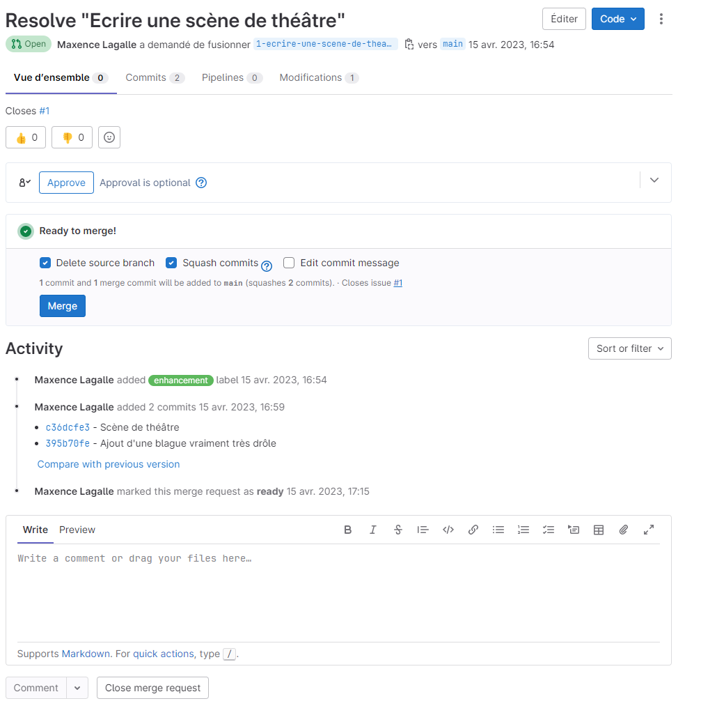

{}

# Travailler avec une forge logicielle
Se synchroniser avec un dépôt distant et travailler de manière collaborative, exploiter les fonctionnalités de la forge logicielle GitLab

---

## Forge logicielle ?

- Une forge logicielle est une plateforme web qui permet aux développeurs de gérer leur code source, de collaborer sur des projets de développement, de suivre les bugs et les problèmes, et de déployer des applications.
- Outre le suivi de version basé sur Git, les forges logicielles incluent des fonctionnalités comme la création de merge requests, la gestion de bugs, la documentation, la gestion des tâches, les tests automatisés et les déploiements continus.

---

- Il existe de nombreuses forges logicielles, les plus populaires aujourd'hui étant [GitHub](https://github.com/), [GitLab](https://gitlab.com/) et [Bitbucket](https://bitbucket.org/).
- Cette formation va s'intéresser à GitLab, mais la plupart des fonctionnalités qui seront présentées se retrouvent sous des formes similaires sur les autres plateformes.
  - GitLab a l'intérêt d'avoir une version open source qui permet de l'installer de manière indépendante dans son propre environnement de production.

---

## Dépôt distant ?

- Un dépôt distant est un dépôt Git hébergé sur un serveur, permettant de centraliser et de redistribuer les modifications d'un projet a toute une équipe.
- Les forges logicielles incluent un serveur Git pour l'hébergement de dépôts distants.

---

## Établir une connexion sécurisée SSH

- Git peut utiliser plusieurs protocoles pour dialoguer avec un dépôt distant. Les plus fréquemment utilisés sont HTTPS et SSH.
- GitLab prend en charge ces deux protocoles : HTTPS via l'utilisation de jetons d'accès et SSH via un système de clés asymétriques.

---

- À l'usage, SSH est généralement le choix le plus simple et performant pour travailler de manière régulière depuis le même ordinateur.
- Sa configuration demande de générer une paire de clés de chiffrement, et de communiquer la clé publique à GitLab.

---

### Générer une paire de clés SSH

- La génération d'une paire de clés SSH s'effectue à partir du terminal de l'ordinateur avec la commande `ssh-keygen` :
  ```bash
  ssh-keygen -t ed25519
  ```
    - `ed25519` est l'algorithme de génération des clés, s'appuyant sur l'algèbre des courbes elliptiques. Il existe également `rsa` qui repose sur la théorie des nombres premiers.

---

- Une fois la commande lancée, le terminal pose plusieurs questions :
  ```console
  Generating public/private ed25519 key pair.
  Enter file in which to save the key (C:\Users\<Utilisateur>/.ssh/id_ed25519):
  ```
  - Appuyer sur "Entrée" pour valider le chemin par défaut, ou préciser un chemin  
  ```console
  Enter passphrase (empty for no passphrase):
  Enter same passphrase again:
  ```
  - Si l'ordinateur n'est pas partagé et correctement sécurisé, il est possible de ne pas saisir de mot de passe.
  - Sinon, le mot de passe saisi ici devra être entré à chaque utilisation de la clé.

---

- Une fois les informations saisies, le terminal confirme la réussite de la création de la clé en donnant ses informations d'identification :
  ```console
  Your identification has been saved in C:\Users\<Utilisateur>\.ssh\id_ed25519
  Your public key has been saved in C:\Users\<Utilisateur>\.ssh\id_ed25519.pub
  The key fingerprint is:
  SHA256:nmqJx3Wutsb8fe75FUDLYiQqJk4E6ZeWe1X6FdvDM+w <Utilisateur>@<Hostname>
  The key's randomart image is:
  +--[ED25519 256]--+
  | .o.     . . .   |
  | ..     ..o.o .  |
  |.  ooo .o  o*+   |
  | .o=o .o  .o.B.  |
  |  o.. . S . . +. |
  |   . . ..o.  E  .|
  |    .o =oo      .|
  |    . =.= ..  ...|
  |     o.oo+. .++..|
  +----[SHA256]-----+
  ```
---

- La clé publique doit alors être renseignée dans GitLab pour pouvoir l'utiliser comme serveur de dépôt distant.
  - Il faut pour cela se connecter à GitLab et accéder à la [page de configuration des clés SSH de GitLab](https://gitlab.com/-/profile/keys).
  

---

- L'empreinte à saisir dans le champ clé peut être obtenue en lisant le fichier de la clé publique dont l'emplacement a été donné précédemment :
  ```bash
  cat C:\Users\<Utilisateur>\.ssh\id_ed25519.pub
  ```
- Le champ "Titre" peut être rempli librement avec un nom permettant de reconnaître la clé.
- Le type d'utilisation "Authentification et Signature" permet d'également utiliser la clé pour signer de manière sécurisée ses commits.
- La date d'expiration est une sécurité facultative pour forcer le renouvellement ponctuel des clés.

---

## Créer un dépôt distant

- La création d'un dépôt distant commence par la [création d'un nouveau projet GitLab](https://gitlab.com/projects/new).
  - Dans un premier temps, il est conseillé de choisir "Create blank project" pour démarrer d'un dépôt vide.

---



- La case "Initialiser le dépôt avec un README" ne doit PAS être cochée si un dépôt local existe déjà.

---

### Relier un dépôt local existant à un dépôt distant

- `git remote` permet de gérer les dépôts distants. Par convention, le dépôt distant principal d'un projet s'appelle `origin`.
- Pour déclarer un nouveau dépôt distant dans un dépôt local existant et lui envoyer tout le contenu actuel, trois commandes sont nécessaires :
  ```bash
  git remote add origin git@gitlab.com:<nom-utilisateur>/<slug-projet>.git
  git push -u origin --all
  git push -u origin --tags
  ```

---

### Cloner localement un dépôt distant

- Si le projet a d'abord été créé comme un dépôt distant, ou pour récupérer le code d'un projet déjà existant, Git permet également le cloner un dépôt distant.
- Le développeur récupère alors une copie locale de l'intégralité des fichiers et de l'historique du projet. La commande à utiliser est `git clone` :
  ```bash
  git clone git@gitlab.com:<nom-utilisateur>/<slug-projet>.git
  ```
  - Le dépôt distant est automatiquement configuré comme `origin`.

---

## Synchroniser le dépôt local et le dépôt distant

- Puisque le dépôt local est une copie intégrale du dépôt distant, le développeur peut travailler en mode déconnecté.
- Néanmoins, il est important de pouvoir régulièrement se synchroniser pour récupérer les modifications faites par les autres et envoyer les siennes.

---

### Envoyer des modifications

- La commande `git push` permet d'envoyer les modifications (les commits) effectuées localement dans une branche :
  ```bash
  git push
  ```
  - Git recherchera une branche portant le même nom que la branche locale sur `origin` et y enverra les modifications locales.
  - Si la branche a été créé localement, l'option `--set-upstream` permet de demander à Git de la créer sur le serveur.

---

- Les opérations sur les tags doivent également être synchronisées avec le serveur grâce à `git pull` :
  ```bash
  git push --tags
  ```
- Si des opérations de réécriture de l'historique ont été menées (comme un rebase), il faudra demander à Git de forcer cette réécriture sur le dépôt distant :
  ```bash
  git push --force-with-lease
  ```
  - Cette opération échouera si d'autres modifications ont été effectuées entre temps sur la branche, pour éviter tout risque de perte de code.

---

### Récupérer des modifications

- Récupérer des modifications revient à fusionner la branche distante dans la branche locale. Cette opération s'effectue grâce à `git pull` :
  ```bash
  git pull
  ```
  - Si on souhaite effectuer cette fusion avec un rebase, il suffit d'ajouter l'option `--rebase`.
  - Le `pull` est en fait l'enchaînement de deux opérations : `fetch` pour télécharger les modifications, puis `merge` pour les intégrer.  

---

## Rôles et permissions

- Même lorsqu'un dépôt est public et peut être cloné librement, GitLab propose un système de contrôle d'accès permettant de donner des droits différenciés aux différents intervenants d'un projet.
- Ces paramètres se règlent à l'échelle du projet dans les options relatives aux Membres.

---

- *Owner* : Le propriétaire du projet est responsable du projet et a tous les droits sur celui-ci.
- *Maintainer* : Les mainteneurs ont les mêmes droits que le propriétaire du projet, à l'exception de la suppression du projet ou de certains éléments.
- *Developer* : Les développeurs peuvent créer des branches, effectuer des commits et des merge requests, et commenter les demandes de fusion. Par défaut, ils ne peuvent pas valider des demandes de fusion ou supprimer des branches protégées.

---

- *Reporter* : Les rapporteurs peuvent créer et gérer des tickets, mais ne peuvent pas effectuer de modifications sur le code source.
- *Guest* : Les invités ont un accès limité en lecture seule au projet et ne peuvent pas effectuer de modifications sur le code source. Ils peuvent être autorisés à créer des tickets.

---

## Gestion des tickets

- GitLab propose un système de gestion de tickets pour les évolutions fonctionnelles (*Issue*) et les bugs (*Incidents*).
- Les tickets peuvent ensuite être visualisés en liste, ou sur un tableau du type Kanban.

---

### Créer un ticket



---

- Un ticket peut être relié à un jalon, par exemple une itération pour un projet Scrum.
- Il peut également être associé à une étiquette dont la liste est définie à l'échelle du projet. Il existe deux approches courantes et complémentaires :
  - Par type de ticket : amélioration, correction de bug, accessibilité...
  - Par phase de travail : spécification, développement, recette...

---

### Gérer un ticket



---

- GitLab permet de décomposer un ticket en sous-tâches, mais aussi de l'associer à d'autres tickets.
- Il est également possible de créer automatiquement une branche liée au ticket, ce qui permet de le clore une fois la branche fusionnée.
- Des outils de gestion du temps (estimation de charge, date d'échéance) sont également proposés.

---

## Branches protégées

- GitLab inclut un mécanisme de protection des branches d'un dépôt.
  - Cette protection permet de contrôler qui peut envoyer ou fusionner du code dans certaines branches, notamment dans `main`.
  - La protection peut obliger à passer par les merge requests pour modifier le code d'une branche.
- Il est toujours possible de faire des fusions ou des ajouts sur le dépôt local dans les branches protégées, mais les opérations de type `git push` seront alors systématiquement rejetées.

---

### Merge Requests

- Une merge request est une demande de fusion, c'est-à-dire que son auteur demande à ce qu'une branche (généralement celle sur laquelle il a travaillé) soit la branche source d'un `git merge` sur une branche cible protégée.
  - Selon la configuration du dépôt, la validation de cette demande peut être soumise à approbation préalable ou à la validation de tests.

---

#### Créer une merge request



---

- La création d'une merge request demande au développeur de préciser les branches source et cible et de décrire ses modifications.
- Il est possible de configurer une merge request pour qu'elle effectue automatiquement un squash lorsqu'elle est validée (*"Écraser les commits lorsque la demande de fusion est validée"*), ou pour supprimer la branche source.

---

#### Valider une merge request



---

- Lorsque le message *"Ready to merge !"* est visible sur une merge request, elle est prête à être validée et fusionnée.
  - L'option *"Delete source branch"* permet de supprimer automatiquement la branche source une fois l'opération terminée
  - *Edit commit message* permet de modifier le message du commit de merge, pour la lisibilité de l'historique.
- Une fois la validation effectuée, l'exécution de la commande `git pull` permet de répercuter la fusion sur le dépôt local.

{}